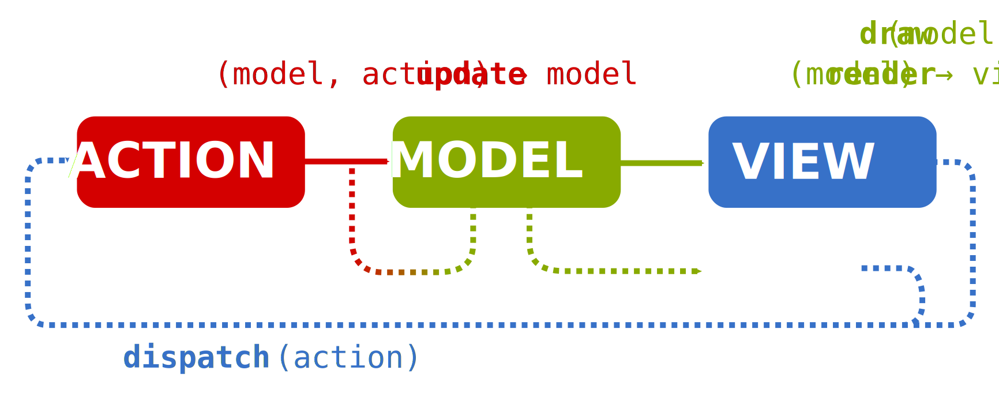

.. _architecture:

Architecture
============

This section gives an overview of the architectural elements of a
Lager based application.  It offers an introductory tutorial with
plenty of pointers into other sections that cover the various topics
in more detail.

Unidirectional-data flow
------------------------

This diagram represents the architecture of a Lager based application,
the so-called *unidirectional data flow architecture*.  It is somewhat
similar to common representations of `Model View Controller`_,
however, there are some fundamental differences:

* The *boxes* do not represent stateful objects with their own identity,
  but **value-types** with deep-copy and logical equality semantics.

* The *arrows* do not represent references or aggregation, but
  **pure functions** that only transform data.

There are only two kinds of stateful procedures, the decoupled
:ref:`effects <effects>`, and the :cpp:func:`dispatch()
<lager::store::dispatch>` method.  We will talk about them later.  In
the following sections, we will focus on the values types and
pure functions that sit at the core of a typical Lager application.

.. _model view controller:
   https://en.wikipedia.org/wiki/Model%E2%80%93view%E2%80%93controller

.. note::

   The diagram above presents the unidirectional data-flow as
   supported by Lager, but there are proposals.  André Staltz gives `a
   thorough overview`_ on the subtle differences between various
   instances of the unidirectional data-flow architecture.

   .. _a thorough overview: https://staltz.com/unidirectional-user-interface-architectures.html

Basic example
-------------

Let's build a very basic example. For now, it is going to be an
interactive application where you can use commands to manipulate a
counter.

We follow a `value-oriented design`_.  we will start by looking at the
data we need, in the form of value types. Then we will look at the
transformations required.

.. _data-oriented-design:

.. admonition:: Differences with Data-Oriented Design.

   Over the last years, we have seen `data-oriented design`_ as a new
   trend in the C++ programming community aiming to go beyond the
   object oriented programming paradigm.  Like DOD, *value-oriented
   design* breaks encapsulation in order to separate data and
   transformations, such that they can be studied explicitly and
   independently.  Often, we end up reaching similar conclusions: we
   decouple entities from their representation, we treat
   :ref:`identity <identity>` explicitly, and prefer :ref:`normalized
   <normalization>` data.

   However DOD is very focused on game development.  As such it
   focuses on performance above all, puting special focus on cache
   locality and mutation.  Maintanibility is not that important is
   games (at least outside of the engine code) since once a game is
   released, the next one is started on a blank slate.  In contrast,
   some of us in the VOD camp come from the development of
   professional desktop software.  While performance is also important
   in this domain, these are decades-old codebases, where intricate
   document models need persistence with backwards compatiblity, and
   implement complicated workflows that need to reliably support undo
   and feel responsive.  As such, we focus more on local reasoning,
   reuse, maintainability and concurrency.

.. _data-oriented design: http://www.dataorienteddesign.com/dodbook/
.. _value-oriented design: https://www.youtube.com/watch?v=_oBx_NbLghY

Model
~~~~~

The :ref:`model <model>` is a value type that contains a snapshot of the state
of the application.  For our example application, something like this
suffices.

.. code-block:: c++

   struct model
   {
       int value = 0;
   };

Actually, we could just have aliased the ``int``, but normally we will
have more complicated models with multiple pieces of data bound
together in a ``struct``.

Actions
~~~~~~~

The :ref:`action <action>` is a value type that represents something that the
user did in the application.  Normally, the user can do multiple
things.  We can use different *structs* to represent the various
things that the user can do, then group them together using a
`std::variant`_

.. code-block:: c++

   struct increment_action {};
   struct decrement_action {};
   struct reset_action { int new_value = 0; };

   using action = std::variant<increment_action, decrement_action, reset_action>;

.. _std::variant: https://en.cppreference.com/w/cpp/utility/variant
.. _business logic: https://en.wikipedia.org/wiki/Business_logic

Reducer
~~~~~~~

Now that we have defined our data, we need to define the update logic,
the :ref:`reducer <reducer>`.  This a `pure function`_ that takes the
current state of the world (the model), some external stimuli (an
action), and returns the updated version of the world. This would look
like this:

.. _pure function: https://en.wikipedia.org/wiki/Pure_function

.. _pattern-match-example:
.. code-block:: c++

   #include <lager/util.hpp>

   model update(model c, action action)
   {
       return std::visit(lager::visitor{
           [&](increment_action) {
               ++ c.value;
               return c;
           },
           [&](decrement_action) {
               -- c.value;
               return c;
           },
           [&](reset_action a) {
               c.value = a.new_value;
               return c;
           },
       },
       action);
   }

Notice that we take and return everything **by value**.  This makes
the function *pure*, even though we do use mutation inside the
function---these mutations are contrained to local variables.  This
somewhat reconciles value-oriented design and procedural programming.
We focus on the purity of our function interface, but in the
implementation, you may choose a more functional or procedural style
at your convenience in an idiomatic C++ style.

Also, don't be intimidated by that :cpp:class:`lager::visitor`, you
can just mentally parse it as a ``switch``/``case`` on `std::variant`_.

Wrapping things up
------------------

We have defined the model of our application.  Maybe this is a bit
overkill for such a small program, but notice the architectural
properties of such design:

* The model is completely independent of the UI, we have a reusable
  definition of data and logic that we can use to make different user
  interfaces.

* The core logic is very easy to test.  Purity makes this specially
  true, since updates are not destructive we can compare the inputs
  with the outputs (the past and the present).  This is how a test
  could look like using the Catch_ framework:

  .. code-block:: c++

     TEST_CASE("counter increment")
     {
         const auto old_model = model{0};
         const auto new_model = update(old_value, increment_action{});
         CHECK(new_model.value == old_model.value + 1);
     }

  This ability to make explicit assertions about change also makes
  advanced testing technices like `property based testing`_ possible.

* We can now generically implement :ref:`undo <undo>` and :ref:`time travel<time-travel>`.

.. _catch: https://github.com/catchorg/Catch2
.. _property based testing: https://en.wikipedia.org/wiki/QuickCheck

User interface
--------------

We will now provide a very simple command line user interface for our
counter application. We can type in the commands **+** (plus sign),
**-** (minus sign) and **.** (dot) to *increment*, *decrement* and
*reset to zero* the counter respectively.  Each time the counter
changes, its current value is printed to the terminal. A session could
look like this::

   current value: 0
   +++
   current value: 1
   current value: 2
   current value: 3
   -
   current value: 2
   .
   current value: 0

.. _intent:
Intent
~~~~~~

The user interacts with the application by typing characters.  Each of
these characters represents one command.  In a way, each character can
be considered *action*.  However these actions are specific to the
user interface, we need to transform them to the actions corresponding
to model operations.

There are several ways to do this.  Later, we will learn how to
:ref:`use effects to dispatch actions as a response to other
actions<intent-effect-example>`. However, in our current scenario, a
function suffices.  We call this function ``intent()``, because it
captures the intention of the user, this is, given something that
happened in the user interface, it tells us what the user wants to do:

.. code-block:: c++

   std::optional<action> intent(char event)
   {
       switch (event) {
       case '+':
           return increment_action{};
       case '-':
           return decrement_action{};
       case '.':
           return reset_action{};
       default:
           return std::nullopt;
       }
   }

Draw
~~~~

Finally, we need to present the current state to the user.  This is
the function that renders the user interface.  It is a function that
only reads the model, and transforms it into a view.  This *view*
could be represented as a value itself---this is the case in Elm_ or if
we use Redux_ in combination with React_.

.. _elm: https://elm-lang.org
.. _redux: https://redux.js.org
.. _react: https://reactjs.org

However, if we are using an `immediate mode`_ interface like ImGui_ or
ncurses_, we can consider the view a procedure that reads the model
and outputs a frame of the UI as a side-effect.  This suffices for our
purposes now:

.. _immediate mode: https://en.wikipedia.org/wiki/Immediate_mode_(computer_graphics)
.. _imgui: https://github.com/ocornut/imgui
.. _ncurses: https://en.wikipedia.org/wiki/Ncurses

.. code-block:: c++

    void draw(counter::model curr)
    {
        std::cout << "current value: " << curr.value << '\n';
    }

.. tip:: In previous versions of the library, the view function used
         be provided the previous value of the model too.  This
         allowed the view to decide which parts of the view do need to
         be updated based on the differences between the old and new
         model values.  If this behavior is wanted, it can be
         simulated by wrapping the view function in a lambda like
         this.

         .. code-block:: c++

             [prev = store.get()] (auto curr) mutable {
                 draw(prev, curr);
                 prev = curr;
             }

Glueing things together
-----------------------

Now we have all the parts that build an application, we can finally
put things together.

Event loop
~~~~~~~~~~

An interactive application is composed of a main loop.  In many UI
frameworks, this is under control of the library, following the
`Hollywood principle`_. Lager provides hooks such that one can teach
the :ref:`store <store>` how to interact with the :ref:`event loop
<event_loop>`.  In this case, we will write the main loop ourselves,
so we can just use :cpp:class:`lager::with_manual_event_loop`.

.. _hollywood principle: http://wiki.c2.com/?HollywoodPrinciple

The store
~~~~~~~~~

The main component provided by the library is the
:cpp:class:`lager::store`.  You make one by providing an action type,
the initial model state, the reducer, the event loop interface.  The
*store* will then provide a thread-safe :cpp:func:`dispatch()
<lager::store::dispatch>` method that can be used to inject actions in
the system.  Whenever it receives an action, it will evaluate the
*reducer* in the event-loop to update the state, and trigger a redraw.

Main loop
~~~~~~~~~

With these components, we can finally implement the ``main()``
procedure of our application:

.. code-block:: c++

   #include <lager/store.hpp>
   #include <lager/event_loop/manual.hpp>

   int main()
   {
       auto store = lager::make_store<counter::action>(
           model{},
           lager::with_manual_event_loop{});
       watch(store, draw);

       auto event = char{};
       while (std::cin >> event) {
           if (auto act = intent(event))
               store.dispatch(*act);
       }
   }

Next steps
----------

In this section we have learnt the basics on how to design an
application using Lager and the *unidirection data-flow
architecture*.  Now you can read further in this user guide:

* In the :ref:`model`, :ref:`actions` and :ref:`reducers` section you
  can learn more about how to design the core of your application.

* In the :ref:`effects` section you will learn how to perform
  side-effects (loading and writing files, talking to a data-base,
  dispatching new actions) without making the *reducer* impure, and
  how to do :ref:`dependency injection <dependency-injection>` to pass
  around the associated services.

* In the :ref:`modularity` section you will learn how to make complex
  applications out of smaller components, both concrete and
  :ref:`generic <genericity>`.

* In the :ref:`views` section you can learn how to integrate different
  UI technologies with your Lager application.

* The :ref:`time travel <time-travel>` section shows how you can use
  Lager for time travelling debugging and introspection.
