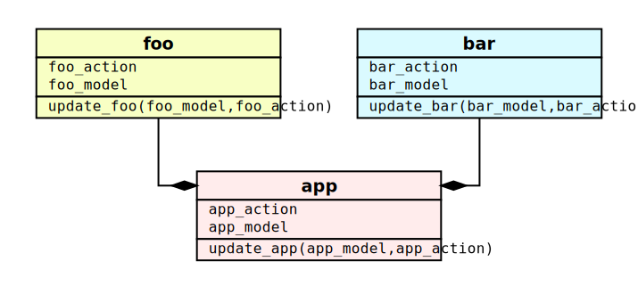

.. _modularity:

Modularity
==========

Until now we have learnt how to build simple self-contained
components.  However, in real world systems, you will have multiple
modules that interact with eachother in various ways, and that are
often developed by different people or teams.  In this section, we
will learn how to scale up our Lager based application.

Composability
-------------

We use the term **module** to refer to a set of :ref:`model`,
:ref:`actions`, :ref:`reducers`, and optionally :ref:`effects` and
:ref:`views`.  This will be the unit of composition in our system.

As an example, we will describe a system with two modules, ``foo`` and
``bar``, that are composed into a bigger module, ``app``.  Unlike in
an object-oriented system, where relationships are often hidden behind
callbacks and associations, we will use simple explicit composition:
data members and function calls.

.. admonition:: Horizontal vs vertical physical organization

   It might be tempting to organize your program in a *horizontal* or
   *layered* manner.  This is, to have separate folders for all your
   actions, models, reducers and views.  If your model is represented
   in different UI's, maybe belonging to different applications, it
   might actually make sense to keep the views separate.  However,
   actions, models and reducers are intimatelly tied together,
   representing different aspects of the same interface.  For this
   reason, it makes sense to keep their definitions close, in the same
   folder or maybe even in the same file.  This is what we call
   *vertical* modularization.

   In this way, your code is organized not around arbitrary technical
   definitions, but around the features of your application.  As you
   scale up your development organization, this will make it easier to
   work on various features in autonomous cross-functional teams that
   integrate product management, design, and full stack
   development. The unidirectional data-flow design proposed by Lager
   helps building clear interfaces between these modules that reduce
   friction at the component, cross-team boundary.

   .. image:: _static/modules.svg
      :width: 100%
      :align: center

Composing models
~~~~~~~~~~~~~~~~

We can simply compose the models by using data composition, for
example, by having the inner models be *members* of the outer model:

.. code-block:: c++

   struct app_model
   {
       foo_model foo;
       bar_model bar;
   };

Composing actions
~~~~~~~~~~~~~~~~~

In previous examples, we used ``std::variant`` to combine multiple
action types describing individual operations.  We can use this
mechanism again to compose the children actions into the parent action
itself:

.. code-block:: c++

   using app_action = std::variant<
       foo_action,
       bar_action>;

Composing reducers
~~~~~~~~~~~~~~~~~~

Now we need to implement a reducer for the parent `app` module. This
reducer needs to invoke the nested reducers and integrate their result
into the parent state.  For example:

.. code-block:: c++

   app_model update(app_model app, app_action act)
   {
       return std::visit(lager::visitor{
           [&] (foo_action a) {
               app.foo = update_foo(app.foo, a);
               return app;
           },
           [&] (bar_action a) {
               app.bar = update_bar(app.bar, a);
               return app;
           },
       }, act);
   }

Composing effects
~~~~~~~~~~~~~~~~~

All the previous reducers do not produce side-effects.  But both the
``foo`` and ``bar`` modules could indeed produce :ref:`effects`, by
having their reducers specified as follows:

.. code-block:: c++

   auto update_foo(foo_model m, foo_action a)
       -> std::pair<foo_model,
                    lager::effect<foo_action, lager::deps<foo_service&>>>;

   auto update_bar(bar_model m, bar_action a)
       -> std::pair<bar_model,
                    lager::effect<bar_action, lager::deps<bar_service&>>>;

Either function can return an effect.  This effect would need to be
returned back by the reducer of the `app`.  However, what is the type
of an effect that can be either of the two submodule types?  We have
to look at the two template parameters of the
:cpp:type:`lager::effect` type:

- To combine the actions, we use an action type that is a superset of
  the two action types.  In this case, ``app_action``.  If we had no
  such superset type, we could use ``lager::actions<foo_action,
  bar_action>`` as a template parameter for the effect, to indicate
  that we want an effect that can deliver either of the two disjoint
  action types.

- To combine the dependencies, we just have to make sure to list all
  the dependencies required by both effects. In our example:
  ``lager::deps<foo_service&, bar_service&>``.

We can now write the app reducer as:

.. code-block:: c++

   using app_result = std::pair<
      app_model,
      lager::effect<app_action, lager::deps<foo_service&, bar_service&>>;

   app_result update(bar_model m, bar_action a)
   {
       return std::visit(lager::visitor{
           [&] (foo_action a) -> app_result {
               auto [new_foo, eff] = update_foo(a);
               app.foo = new_foo;
               return {app, eff};
           },
           [&] (bar_action a) -> app_result {
               auto [new_bar, eff] = update_bar(a);
               app.bar = new_bar;
               return {app, eff};
           },
       }, act);
   }

.. note:: In this case, we had two different paths producing two
          different effects.  It might happen sometimes, that you end
          up with two effects in the same path that you need to
          combine.  You can use the :cpp:func:`lager::sequence`
          function for this.  It will return the first non empty
          effect or a combined effect that evaluates all in sequence.
          It uses the rules above to derive the correct result type.

.. _undo:
.. _genericity:

Genericity
----------

One of the advantages of having homogenous concepts with some general
semantics is that one can implement generic modules that compose over
an underlying module to extend its functionality.

A generic module
~~~~~~~~~~~~~~~~

One example is a ``history`` module that implements *undo* over an
underlying document model.  The document model has a data model and a
set of actions and associated reducer to manipulate it. Our module
enhances the document by keeping a history of previous states, and
allowing the user to undo or redo changes, or maybe even jump to an
arbitrary position in the undo history.

We can leverage the value semantics of the model and the purity of the
reducer to implement this feature in a general way.  First, let's
define the actions:

.. code-block:: c++

   struct undo_action {};
   struct redo_action {};
   struct goto_action { std::size_t position; };

   template <typename DocumentAction>
   using history_action = std::variant<
       DocumentAction,
       undo_action, redo_action, goto_action>

Note how ``history_action`` is templatized over the underlying
document action, which is also included in the action variant.

We can now define the model:

.. code-block:: c++

   template <typename DocumentModel>
   struct history_model
   {
       immer::array<DocumentModel> history;
       std::size_t position = 0;

       // construct a history from a document
       history_model(DocumentModel init = {})
           : history{immer::array<DocumentModel>{{std::move(init)}}}
       {}

       // get the current document
       operator const DocumentModel&() const { return history[position]; }
   };

Again, we templatized the model over the underlying type.  We also
implemented conversion from the underlying model that constructs a
history with an initial state.  The history can also be converted to
the underlying document model to obtaining the current state.  This
allows us to pass the history model directly to views that want to
present the current document.

Now we can finally define a reducer for our ``history`` module.  Note
how we need to pass the reducer of the underlying document model.  We
could avoid this by assuming that the reducer has a specific name,
like the conventional ``update()``.  It does not harm to be explicit
though.  We can later use a lambda to bind the particular reducer.

.. code-block:: c++

   template <typename DocumentReducer,
             typename DocumentModel,
             typename DocumentAction>
   auto update_history(DocumentReducer&& r,
                       history_model<DocumentModel> m,
                       history_action<DocumentAction> a)
       -> history_model<DocumentModel>
   {
      return std::visit(lager::visitor{
          [&] (undo_action a) {
              return update_history(r, m, goto_action{m.position - 1});
          },
          [&] (redo_action a) {
              return update_history(r, m, goto_action{m.position + 1});
          },
          [&] (goto_action a) {
              if (a.position >= 0 && a.position < m.history.size())
                  m.position = a.position;
              return m;
          },
          [&] (DocumentAction a) {
              auto doc = r(m, a);
              if (doc != m) {
                  m.position ++;
                  m.history = m.history.take(m.position).push_back(doc);
              }
              return m;
          },
      }, act);
   }

The ``history`` specific actions just manipulate the current position.
However, the ``DocumentAction`` handler is of particular interest.  We
obtain an updated document by evaluating the underlying reducer and,
if the document actually changed, whe put the new state in the
history.  The ``take()`` call discards entries happening after the
current position.  This is the standard behavior in an editor: after
you do some *undos*, you loose the ability to *redo* as soon as you
make a new edit.  There are other possible ways to handle this case:
in our example text editor Ewig_ we use `Emacs style undo`_.

.. _Ewig: https://github.com/arximboldi/ewig
.. _emacs style undo: https://www.gnu.org/software/emacs/manual/html_node/emacs/Undo.html

Dealing with underlying effects
~~~~~~~~~~~~~~~~~~~~~~~~~~~~~~~

The previous reducer did not deal with :ref:`effects`.  This might be
a reasonable constraint in this case, since it is unclear how
meaningful are side-effects in an undoable document.  However, we can
still change the reducer to deal with potential side effects.  We use
the :cpp:func:`lager::invoke_reducer` function to invoke a reducer
that may or may not have side effects in a generic way. Note that we
now have to inform the generic reducer of potential dependencies that
the effects returned by the underlying reducer might need.

.. code-block:: c++

   template <typename DocumentDeps = lager::deps<>,
             typename DocumentReducer,
             typename DocumentModel,
             typename DocumentAction>
   auto update_history_with_effects(DocumentReducer&& r,
                                    history_model<DocumentModel> m,
                                    history_action<DocumentAction> a)
       -> std::pair<history_model<DocumentModel>,
                    lager::effect<DocumentAction, DocumentDeps>>
   {
      return std::visit(lager::visitor{
          [&] (undo_action a) {
              return update_history(r, m, goto_action{m.position - 1});
          },
          [&] (redo_action a) {
              return update_history(r, m, goto_action{m.position + 1});
          },
          [&] (goto_action a) {
              if (a.position >= 0 && a.position < m.history.size())
                  m.position = a.position;
              return {m, lager::noop};
          },
          [&] (DocumentAction a) {
              auto eff = lager::effect<DocumentAction, DocumentDeps>{lager::noop};
              auto doc = lager::invoke_reducer<DocumentDeps>(
                  r, static_cast<DocumentModel>(m), a,
                  [&](auto e) {
                      eff = e;
              });
              m.position = m.history.size();
              m.history = m.history.take(m.position).push_back(doc);
              return {m, eff};
          },
      }, act);
   }

.. tip:: In this implementation we always return an effect type,
         regardless of whether the underlying reducer uses effects at
         all---if it doesn't, it will unconditionally be a
         ``lager::noop``.  It is possible however to avoid that, by
         using the :cpp:class:`lager::has_effect` metafunction to only
         return an effect if needed.

.. _enhancer:

Enhancer interface
~~~~~~~~~~~~~~~~~~

Given a concrete ``doc`` module composed of a ``doc_model``,
``doc_action`` and ``update_doc()`` reducer, we can produce a store
that uses it, enhanced with the ``history`` functionality:

.. code-block:: c++

   auto store = lager::make_store<history_action<doc_action>>(
       history_model<doc_model>{},
       [] (auto m, auto a) { return update_history(update_doc, m, a); });

It would be nice, however, if we could write instead:

.. code-block:: c++
   :emphasize-lines: 5

   auto store = lager::make_store<doc_action>(
       doc_model,
       lager::with_reducer(update_doc),
       with_history);

We can indeed write such a ``with_history`` construction, by using the
*enhancer* interface.  After passing the model, reducer and view to
the :cpp:func:`make_store` function, we can pass as many enhancers as
we want.  These allow it to extend the store with generic middleware,
like our undo history.

An *enhancer* is just a function that takes a *store factory* as an
argument and returns a new factory with the same signature.  It must
use the provided factory to produce the store, but it can manipulate
its arguments.  We can implement the ``with_history`` enhancer as
follows:

.. code-block:: c++

   auto with_history = [] (auto next)
   {
       return [=] (auto action,
                   auto model,
                   auto reducer,
                   auto loop,
                   auto deps)
       {
           using action_t = typename decltype(action)::type;
           using model_t  = decltype(model);
           using deps_t   = decltype(deps);
           return next(
               lager::type_<history_action<action_t>>,
               history_model<model_t>{model},
               [reducer](auto m, auto a) { return update_history(reducer, m, a); },
               loop,
               deps);
       };
   };

.. warning:: To avoid syntactic noise, we did not use `perfect
             forwarding`_ in this example.  See the implementation of
             the :cpp:func:`lager::with_debugger` enhancer to see how
             to use perfect forwarding in this case.

.. _perfect forwarding: https://en.cppreference.com/w/cpp/utility/forward

Actors
------

In this section, we have seen how to combine and decorate models to
create more complex applications.  However, we are still using one
single big central store.  That is the normal mode of operation of
Lager, which was designed to write interactive software using the
unidirectional data-flow architecture.  Most of the application is
agnostic to the store anyways.  Having a single store means we have a
single place where mutation happens, which helps us avoid race
conditions and eases testing and debugging the application.

But there are indeed cases where it might be useful to have multiple
stores.  Since a store is associated to one event loop and a thread,
you may want to use multiple stores to increase the parallelism of the
app.

The `Actors programming model`_ is a paradigm of concurrent computing
that is based around independent entities, known as *actors*, that
communicate with eachother via messages, as opposed to using shared
memory.  A :cpp:class:`lager::store` can be considered an Actor, to
which you send messages using the
:cpp:func:`dispatch()<lager::store::dispatch>` method.  A store can
communicate with other actors using :ref:`effects` or :ref:`views`.

Architecting your application around multiple actor stores that talk
to eachother is a powerful tool to build distributed systems.  You can
use the store event loop interface to flexibly configure the level of
parallelism for these intercommunicating entities.  Furthermore, if
you make your actions serializable, you can further scale up your
application by having actors run seamlessly on different machines,
sending eachother messages over network pipes.

.. _actors programming model: https://en.wikipedia.org/wiki/Actor_model
