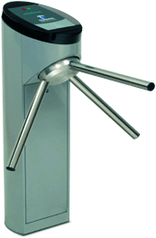
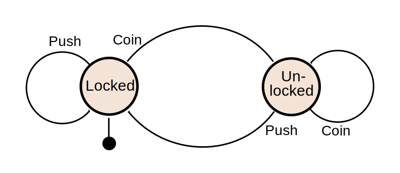

.. _reducers:

Reducers
========

Reducers are functions given a :ref:`model` and :ref:`action`,
implements the update logic of the application, returning a new model
the world.

.. _purity:
Purity
------

The reducer must be `referentially transparent`_ and a `pure
function`_.  This is a mouthful to say that, whenever you invoke the
function with the same arguments, it produce the same result.  This,
in practice, means:

- It must take all the arguments by value or const reference.
- It must perform no side-effects, this is: no writing or reading to
  disk, generating non deterministic random numbers, making
  connections to servers, etc.
- And of course, no reading or writing mutable globals, statics,
  singletons, and other evils.

Sadly, C++ has no builtin mechanism to enforce function purity and
this depends only on programmer discipline.  It is technically
possible to perform side effects directly from the reducer, but it is
hard to say in general terms how much this messes up with the system.
For programs that rely on the reproducibility of the reducer to
implement *undo* or *time travel*, it can have fatal consequences.

.. tip:: While the reducer must not *perform* side effects, it
         definitelly can, and often should, *describe* side
         effects. The :ref:`effects` section covers this aspect in
         detail.

.. _pure function: https://en.wikipedia.org/wiki/Pure_function
.. _referentially transparent: https://en.wikipedia.org/wiki/Referential_transparency

Why the name?
-------------

Given an ``action``, ``model`` types, and a ``update`` reducer
function (in the :ref:`architecture` section we built a complete
example), we can write a function that takes an initial model, a
sequence of actions, and returns the current model after applying all
the actions like this:

.. code-block:: c++

   model update_all(model init, const std::vector<action>& actions)
   {
       return std::accumulate(
           actions.begin(), actions.end(),
           init,
           update);
   }

The ``std::accumulate`` function is called ``reduce`` in many other
languages, like Python, JavaScript, Scheme or Clojure.  It takes a
sequence of inputs and a binary operation, and it "reduces" the
sequence to a single value, by succesively applying the binary
operator to the last output and the next input.

The **reducer** is the binary operation that we use to *reduce* a
sequence of actions to a single model state---it is the last argument
we passed to ``accumulate``.

.. note:: *Reduce*, also known as *fold*, is one of the most important
          `higher-order functions`_ in functional programming, because
          it provides a general mechanism for performing iterative
          sequential computations.  Transducers_ are a powerful
          abstraction based on the idea of *transforming reducers*.

.. _std::accumulate: https://en.cppreference.com/w/cpp/algorithm/accumulate
.. _transducers: https://www.youtube.com/watch?v=vohGJjGxtJQ
.. _higher-order functions: https://en.wikipedia.org/wiki/Higher-order_function

State machines
--------------

As we depart from Object-Oriented Design and abandon UML class
diagrams, we find ourselves devoid of modeling tools and visual
representations for our system.  `State machines`_ are a good tool to
model Lager based systems, specially components with asynchronicity
and transient states. We can follow the following analogies:

.. _state machines: https://en.wikipedia.org/wiki/Finite-state_machine

.. tabularcolumns:: |R|L|

====================== ======================
  **model**              *states*
  **actions**            *transitions*
  **reducer**            *transition table*
====================== ======================

Consider the example of a *turnstile*.  A turnstile, used to control
access to subways and amusement park rides, is a gate with three
rotating arms at waist height, one across the entryway. Initially the
arms are locked, blocking the entry, preventing patrons from passing
through. Depositing a coin or token in a slot on the turnstile unlocks
the arms, allowing a single customer to push through. After the
customer passes through, the arms are locked again until another coin
is inserted.  This can be modelled by the following state
diagram: (source_)

.. _source: https://en.wikipedia.org/wiki/Finite-state_machine

Such diagram can be systematically translated into :ref:`model`,
:ref:`action` and :ref:`reducers`, so that it can be executed in a
Lager application:

.. code-block:: c++

   #include <lager/util.hpp>

   struct locked {};
   struct unlocked {};
   using model = std::variant<locked, unlocked>;

   struct push {};
   struct coin {};
   using action = std::variant<push, coin>;

   model update(model m, action a)
   {
       return std::visit(lager::visitor{
           [] (push) { return locked{}; },
           [] (coin) { return unlocked{}; },
       }, a);
   }

In this case, the model was so simple that we only needed to pattern
match the *action*.  In more complicated cases we might need to
analize the state inside the action (or otherwise) to fully implement
the transition table.
