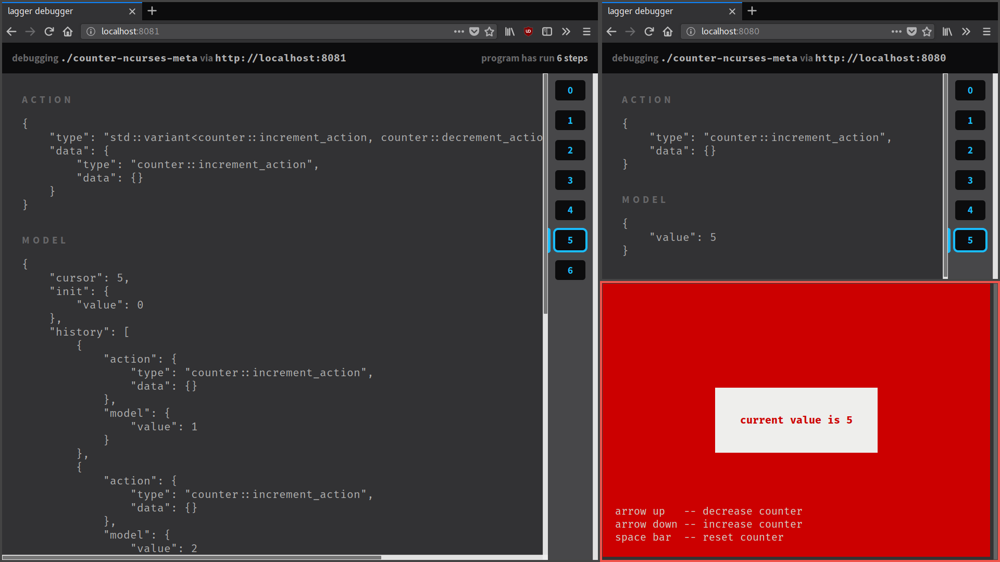

.. _time-travel:

Time travel
===========

In the previous section we saw how we can generically augment a Lager
application with :ref:`undo support<undo>`.  The library uses these
principles to provide a *time travelling debugger*.

.. _screenshot:

Time travelling debugger
------------------------

The time travelling debugger tool allows you to inspect the state and
actions of a running Lager application.  Furthermore, you can use it
to bring the application to a previous state and continue running it
from there.

The screenshot_ above shows the debugger in action.  At the bottom
right corner we have a running Lager application, `an ncurses UI for
our counter example`_.  On the top right we have the UI of the time
travelling debugger inspecting the application.  On the right, we have
a time-travelling debugger, debugging the former time-travelling
debugger itself!

.. _an ncurses ui for our counter example: https://github.com/arximboldi/lager/tree/master/example/counter/ncurses

Enabling the debugger
---------------------

You can enable the debugger by using the
:cpp:func:`lager::with_debugger` :ref:`enhancer<enhancer>`.

.. code-block:: c++

   #include <lager/debug/http_server.hpp>
   #include <lager/debug/debugger.hpp>
   #include <lager/store.hpp>

   auto debugger = lager::http_debug_server{argc, argv, 8080};
   auto store    = lager::make_store<...>(
       ...,
       lager::with_debugger(debugger));

This enables the debugger, which can be accessed from
http://localhost:8080 in a web browser.

Since *enhancers* are compossable, you can instantiate a second
debugger, that allows the inspection the state of the debugger itself:

.. code-block:: c++

   auto debugger      = lager::http_debug_server{argc, argv, 8080};
   auto meta_debugger = lager::http_debug_server{argc, argv, 8081};
   auto store         = lager::make_store<...>(
       ...,
       lager::with_debugger(debugger),
       lager::with_debugger(meta_debugger));

Debugger API
------------

The debugger also exposes an API that can be used to programatically
inspect and query the application from the outside, via HTTP requests
that return JSON data.  It has the following endpoints.

    GET ``/api/``
        Returns the current status of the application,
        including the number of existing steps and pause state.
    GET ``/api/step/{cursor}``
        Query the action and resulting model at step number ``cursor``.
    POST ``/api/goto/{cursor}``
        Bring the application to the state number ``cursor``.
    POST ``/api/undo``
        Bring the application one step back.
    POST ``/api/redo``
        Bring the application one step forward.
    POST ``/api/pause``
        Pause the application (it its event loop supports it).
    POST ``/api/resume``
        Resume a paused application (it its event loop supports it).

Serialization
-------------

For the debugger to work, the states and actions must be serializable
to JSON using the Cereal_ library.

Cereal itself already knows, out of the box, how to serialize most
standard library value types and containers.  Lager includes
extensions supporting C++17 types like ``std::variant`` and
``std::optional``, as the Immer_ collections.

.. _cereal: https://github.com/USCiLab/cereal
.. _immer: https://sinusoid.es/immer/

For custom types you have to define the serialization yourself.  This
is however quite easy with the provided ``LAGER_CEREAL_STRUCT`` macro:

.. code-block:: c++

   #include <lager/extra/cereal/struct.hpp>

   struct model
   {
       int value;
       immer::box<std::string> name;
       immer::vector<double> times;
   };

   LAGER_CEREAL_STRUCT(model, (value)(name)(times));
